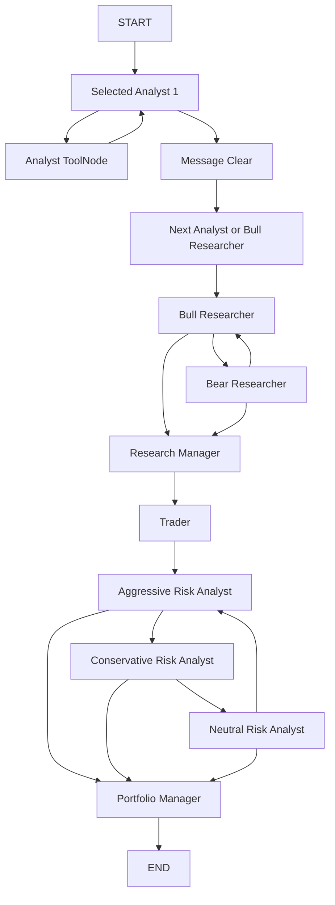

# TradingAgents 프로젝트 동작 구조 정리

작성 기준: 2026-07-09 현재 로컬 프로젝트 상태  
범위: 기존 TradingAgents 구조 + 공용 `.env` + 한국 종목/Naver 뉴스 + Toss API 주문 dry-run/실주문 연동

## 1. 프로젝트 목표

TradingAgents는 여러 LLM agent가 금융 데이터를 수집하고 토론하여 최종 투자 판단을 생성하는 multi-agent trading framework입니다.

현재 로컬 커스터마이징의 목표는 다음입니다.

- 미국/글로벌 종목뿐 아니라 한국 종목을 `005930.KS`, `035720.KQ` 같은 Yahoo Finance 표기로 분석
- Naver Search API를 TradingAgents 내부 독립 news vendor로 사용
- 공용 `/Users/leejang2/Project/.env`에서 OpenAI, Naver, Toss API 키를 읽음
- 최종 Portfolio Manager 판단을 Toss 주문 계획으로 변환
- 기본은 `dry-run` 모의 체결 기록, 명시적으로 `--execute`를 줄 때만 Toss 실제 주문 전송

## 2. 실행 환경

공용 Python 가상환경:

```bash
/Users/leejang2/Project/.venv
```

공용 환경변수 파일:

```bash
/Users/leejang2/Project/.env
```

TradingAgents는 `tradingagents/__init__.py`에서 `python-dotenv`의 `find_dotenv(usecwd=True)`를 사용해 현재 작업 디렉터리 기준으로 `.env`를 찾습니다. 따라서 `/Users/leejang2/Project/TradingAgents`에서 실행하면 상위 `/Users/leejang2/Project/.env`도 자동 탐색됩니다.

로컬 실행 산출물은 다음 경로에 저장합니다.

```bash
/Users/leejang2/Project/TradingAgents/.local/
```

`.local/`은 `.gitignore`에 추가되어 git 추적 대상이 아닙니다.

## 3. 사용 API

### OpenAI API

용도:

- analyst, researcher, trader, risk, portfolio manager agent의 LLM reasoning
- structured output 기반 의사결정 생성

필수 환경변수:

```bash
OPENAI_API_KEY=...
```

현재 smoke/dry-run 검증에서 사용한 모델:

```bash
gpt-5.5
```

참고: `gpt-5.5`는 현재 OpenAI 기본 실행 모델로 사용하도록 `main.py`, 실행 스크립트, 모델 카탈로그에 등록되어 있어 known model warning 없이 실행됩니다. `gpt-5.6-luna`는 공식 문서에는 표시되지만 현재 계정에서는 limited preview로 API 호출이 거부되어 기본값에서 제외했습니다.

### Yahoo Finance / yfinance

용도:

- 주가 OHLCV
- 기술적 지표 계산용 가격 데이터
- 일부 fundamental/news fallback
- 한국 종목 분석 시 `005930.KS` 같은 Yahoo ticker 사용

별도 API 키는 필요 없습니다.

### Naver Search API

용도:

- 한국 종목 뉴스
- 한국/글로벌 매크로 뉴스 보강
- 한국 종목 실행 전 `.local/news/analysis_naver_<ticker>_<date>.json` 스냅샷을 수집하고 agent 도구 호출 시 해당 스냅샷을 우선 사용

필수 환경변수:

```bash
NAVER_CLIENT_ID=...
NAVER_CLIENT_SECRET=...
```

추가된 내부 모듈:

```bash
tradingagents/dataflows/naver_news.py
```

지원 함수:

- `get_news_naver(ticker, start_date, end_date)`
- `get_global_news_naver(curr_date, look_back_days, limit)`

기본 한국 종목 검색어 매핑 예:

```text
005930 -> 삼성전자
000660 -> SK하이닉스
035420 -> NAVER
035720 -> 카카오
005380 -> 현대차
```

매핑은 config의 `naver_news_query_map`으로 확장할 수 있습니다.

### Toss Invest Open API

용도:

- Portfolio Manager 최종 판단을 기반으로 Toss 주문 계획 생성
- `--execute` 지정 시 실제 주문 전송

필수 환경변수:

```bash
TOSS_CLIENT_ID=...
TOSS_CLIENT_SECRET=...
TOSS_ACCOUNT_SEQ=...
```

추가된 내부 모듈:

```bash
tradingagents/brokers/toss_client.py
tradingagents/brokers/toss_executor.py
```

기본 안전 정책:

- `dry-run`이 기본값이며 주문 payload가 있으면 사용자 승인 없이 paper trade로 기록
- `--execute` 없이는 실제 주문 전송 안 함
- dry-run paper trade 기록 경로: `.local/paper_trades/trades.jsonl`
- `--execute`를 줘도 `--yes`가 없으면 콘솔에서 `YES` 입력 요구
- 최종 rating이 `Hold`면 주문 payload 생성 안 함

## 4. 주요 디렉터리 구조

```text
TradingAgents/
  tradingagents/
    default_config.py
    dataflows/
      interface.py
      y_finance.py
      yfinance_news.py
      alpha_vantage*.py
      naver_news.py              # 추가됨
    llm_clients/
      factory.py
      openai_client.py
      google_client.py
      anthropic_client.py
      ...
    agents/
      analysts/
      researchers/
      risk_mgmt/
      trader/
      managers/
      utils/
    graph/
      trading_graph.py
      setup.py
      conditional_logic.py
      propagation.py
      signal_processing.py
    brokers/                     # 추가됨
      toss_client.py
      toss_executor.py
  scripts/
    run_minimal_analysis.py       # 추가됨
    run_korea_toss_analysis.py    # 추가됨
  docs/
    korea_toss_integration.md     # 추가됨
    project_architecture_current.md
  tests/
    test_naver_vendor.py          # 추가됨
    test_toss_executor.py         # 추가됨
```

## 5. 설정 구조

기본 설정은 `tradingagents/default_config.py`의 `DEFAULT_CONFIG`에 있습니다.

중요 설정:

```python
"llm_provider": "openai"
"deep_think_llm": "gpt-5.5"
"quick_think_llm": "gpt-5.4-mini"
"output_language": "English"
"max_debate_rounds": 1
"max_risk_discuss_rounds": 1
"data_vendors": {
    "core_stock_apis": "yfinance",
    "technical_indicators": "yfinance",
    "fundamental_data": "yfinance",
    "news_data": "yfinance",
    "macro_data": "fred",
    "prediction_markets": "polymarket",
}
```

이번 커스터마이징에서 추가/확장한 설정:

```python
"naver_news_display": 10
"naver_news_sort": "date"
"naver_news_query_map": {}
"naver_global_news_queries": [...]
```

환경변수 override:

```bash
TRADINGAGENTS_LLM_PROVIDER=openai
TRADINGAGENTS_DEEP_THINK_LLM=gpt-5.5
TRADINGAGENTS_QUICK_THINK_LLM=gpt-5.5
TRADINGAGENTS_OUTPUT_LANGUAGE=Korean
TRADINGAGENTS_NEWS_DATA_VENDOR=naver,yfinance
```

`TRADINGAGENTS_NEWS_DATA_VENDOR=naver,yfinance`는 `data_vendors["news_data"]`를 바꾸며, Naver 실패 시 Yahoo Finance news로 fallback합니다.

## 6. 데이터 vendor 라우팅 구조

데이터 접근은 `tradingagents/dataflows/interface.py`가 담당합니다.

핵심 함수:

```python
route_to_vendor(method, *args, **kwargs)
```

동작:

1. method가 속한 category를 찾음
2. config의 `data_vendors` 또는 `tool_vendors`에서 vendor chain 확인
3. vendor chain 순서대로 구현 함수 호출
4. rate limit, 미설정, no data 등의 오류를 공통 규칙으로 처리

주요 method와 vendor:

```text
get_stock_data        -> yfinance, alpha_vantage
get_indicators        -> yfinance, alpha_vantage
get_fundamentals      -> yfinance, alpha_vantage
get_news              -> naver, yfinance, alpha_vantage
get_global_news       -> naver, yfinance, alpha_vantage
get_macro_indicators  -> fred
get_prediction_markets-> polymarket
```

이번 변경으로 `VENDOR_LIST`와 `VENDOR_METHODS`에 `naver`가 추가되었습니다.

## 7. Agent 전체 실행 흐름

중심 클래스:

```python
tradingagents/graph/trading_graph.py
TradingAgentsGraph
```

실행 메서드:

```python
final_state, decision = graph.propagate(ticker, trade_date)
```

전체 흐름:



실제 graph 구성은 `tradingagents/graph/setup.py`의 `GraphSetup.setup_graph()`에서 LangGraph `StateGraph`로 생성됩니다.

## 8. Analyst Team 구조

선택 가능한 analyst:

```python
selected_analysts=("market", "social", "news", "fundamentals")
```

### Market Analyst

파일:

```bash
tradingagents/agents/analysts/market_analyst.py
```

도구:

- `get_stock_data`
- `get_indicators`
- `get_verified_market_snapshot`

역할:

- OHLCV 가격 분석
- 이동평균, MACD, RSI, Bollinger Band, ATR 등 기술지표 해석
- market snapshot 기반으로 데이터 hallucination을 줄임

### Sentiment / Social Analyst

파일:

```bash
tradingagents/agents/analysts/sentiment_analyst.py
```

도구:

- `get_news`

역할:

- 뉴스/소셜성 정보 기반 market mood 파악
- 현재 로컬 커스터마이징에서는 Naver vendor 선택 시 한국 뉴스도 여기에 들어갈 수 있음

### News Analyst

파일:

```bash
tradingagents/agents/analysts/news_analyst.py
```

도구:

- `get_news`
- `get_global_news`
- `get_insider_transactions`
- `get_macro_indicators`
- `get_prediction_markets`

역할:

- 종목 뉴스와 글로벌/매크로 뉴스를 종합
- 한국 종목 실행 시 Naver 뉴스가 `get_news`, `get_global_news`의 primary vendor가 될 수 있음
- FRED 키가 없으면 macro data는 optional sentinel로 degrade되어 전체 실행은 계속됨

### Fundamentals Analyst

파일:

```bash
tradingagents/agents/analysts/fundamentals_analyst.py
```

도구:

- `get_fundamentals`
- `get_balance_sheet`
- `get_cashflow`
- `get_income_statement`

역할:

- 재무제표, 현금흐름, 손익계산서, 기본 기업 정보 분석
- 한국 종목은 Yahoo Finance coverage 품질에 따라 결과 품질이 달라질 수 있음

## 9. Research Team 구조

파일:

```bash
tradingagents/agents/researchers/bull_researcher.py
tradingagents/agents/researchers/bear_researcher.py
tradingagents/agents/managers/research_manager.py
```

### Bull Researcher

역할:

- analyst report를 바탕으로 bullish thesis 작성
- 성장성, 모멘텀, upside catalyst 강조

### Bear Researcher

역할:

- bearish thesis 작성
- valuation, macro risk, data weakness, downside catalyst 강조

### Research Manager

역할:

- Bull/Bear 토론을 종합
- structured output으로 투자 계획 생성
- 결과는 `investment_plan`에 저장

debate 반복 횟수:

```python
max_debate_rounds
```

조건 분기는 `tradingagents/graph/conditional_logic.py`의 `should_continue_debate()`가 담당합니다.

## 10. Trader 구조

파일:

```bash
tradingagents/agents/trader/trader.py
```

역할:

- Research Manager의 `investment_plan`을 받아 구체적 trade plan 생성
- action, reasoning, position sizing, final transaction proposal 작성

결과 state:

```python
trader_investment_plan
```

## 11. Risk Management Team 구조

파일:

```bash
tradingagents/agents/risk_mgmt/aggressive_debator.py
tradingagents/agents/risk_mgmt/conservative_debator.py
tradingagents/agents/risk_mgmt/neutral_debator.py
tradingagents/agents/managers/portfolio_manager.py
```

### Aggressive Analyst

역할:

- 적극적 포지션 확대 관점
- upside opportunity와 momentum 활용 강조

### Conservative Analyst

역할:

- 원금 보존과 downside risk 강조
- 변동성, 손절, 과열, macro risk 중심

### Neutral Analyst

역할:

- 균형적 관점
- 포지션 크기, 분할 진입, 관망 조건 등 절충안 제시

### Portfolio Manager

역할:

- risk debate 전체를 종합
- 최종 rating과 investment thesis 생성
- 최종 결과는 `final_trade_decision`

rating scale:

```text
Buy
Overweight
Hold
Underweight
Sell
```

rating parser:

```bash
tradingagents/agents/utils/rating.py
```

## 12. 최종 signal 처리

파일:

```bash
tradingagents/graph/signal_processing.py
```

`SignalProcessor.process_signal(text)`는 Portfolio Manager의 markdown 결과에서 rating을 추출합니다.

추가 LLM 호출 없이 deterministic parser를 사용합니다.

```python
parse_rating("**Rating**: Hold") -> "Hold"
```

## 13. 한국 종목 연동 구조

분석 ticker:

```text
005930.KS
035720.KQ
```

주가/기술지표:

- Yahoo Finance / yfinance가 처리
- suffix가 포함된 ticker를 그대로 사용

Naver 뉴스:

- `005930.KS` 입력 시 내부적으로 base symbol `005930` 추출
- 기본 query map에서 `삼성전자`로 변환
- Naver Search API 호출

Toss 주문:

- Toss는 `005930.KS`가 아니라 `005930`을 기대
- `tradingagents/brokers/toss_executor.py`의 `toss_symbol()`이 suffix 제거

```python
toss_symbol("005930.KS") == "005930"
```

## 14. Toss 주문 연동 구조

파일:

```bash
tradingagents/brokers/toss_client.py
tradingagents/brokers/toss_executor.py
```

### TossClient

담당:

- OAuth token 발급
- API 요청 header 구성
- `X-Tossinvest-Account` account header 추가
- 주문 생성 API 호출

현재 구현된 주요 메서드:

- `issue_token()`
- `get_prices(symbols)`
- `get_buying_power(currency)`
- `create_order(order)`

### TossOrderPlan

`toss_executor.py`의 dataclass:

```python
TossOrderPlan(
    action="BUY" | "SELL" | "HOLD",
    rating="Buy" | "Overweight" | "Hold" | "Underweight" | "Sell",
    symbol="005930",
    quantity="1",
    order_amount=None,
    order_type="MARKET",
    time_in_force="DAY",
    reason="..."
)
```

### Rating -> Toss action 매핑

```text
Buy, Overweight       -> BUY
Hold                  -> HOLD, 주문 없음
Underweight, Sell     -> SELL plan
```

### 주문 payload 예

```json
{
  "clientOrderId": "ta-buy-005930-...",
  "symbol": "005930",
  "side": "BUY",
  "orderType": "MARKET",
  "timeInForce": "DAY",
  "quantity": "2"
}
```

### 안전장치

- `execute=False`면 API 주문 전송 안 함
- `run_korea_toss_analysis.py`는 기본 dry-run
- `--execute`가 있어야 실제 주문
- `--execute`만 있고 `--yes`가 없으면 사용자가 `YES`를 입력해야 함
- `Hold`면 payload가 `{}`이므로 주문 없음

## 15. 주요 실행 스크립트

### 최소 TradingAgents 분석

파일:

```bash
scripts/run_minimal_analysis.py
```

예:

```bash
cd /Users/leejang2/Project/TradingAgents
../.venv/bin/python scripts/run_minimal_analysis.py \
  --ticker AAPL \
  --date 2024-05-10 \
  --model gpt-5.5 \
  --language Korean
```

기능:

- `selected_analysts=("market",)`로 가볍게 분석
- 리포트 저장
- 최종 decision 출력

### 한국 종목 + Naver + Toss dry-run

파일:

```bash
scripts/run_korea_toss_analysis.py
```

예:

OpenAI:

```bash
cd /Users/leejang2/Project/TradingAgents
../.venv/bin/python scripts/run_korea_toss_analysis.py \
  --provider openai \
  --ticker 005930.KS \
  --date 2026-07-08 \
  --model gpt-5.5 \
  --max-order-amount 100000
```

Local Ollama:

```bash
brew install --cask ollama
ollama pull qwen3:8b

cd /Users/leejang2/Project/TradingAgents
../.venv/bin/python scripts/run_korea_toss_analysis.py \
  --provider ollama \
  --model qwen3:8b \
  --ticker 005930.KS \
  --date 2026-07-08 \
  --max-order-amount 100000
```

기능:

1. `005930.KS` 분석
2. Naver Search API로 최근 뉴스 스냅샷 JSON 자동 수집
3. market analyst + news analyst 실행
4. news vendor는 `naver,yfinance`, Naver는 수집 스냅샷을 우선 사용
5. Research/Trader/Risk/Portfolio graph 실행
6. 리포트 저장
7. 최종 rating을 TossOrderPlan으로 변환
8. 기본 dry-run으로 주문 payload가 있으면 사용자 승인 없이 paper trade 기록

실제 주문:

```bash
../.venv/bin/python scripts/run_korea_toss_analysis.py \
  --provider openai \
  --ticker 005930.KS \
  --date 2026-07-08 \
  --model gpt-5.5 \
  --max-order-amount 100000 \
  --execute
```

## 16. 검증된 실행 결과

### OpenAI smoke test

결과:

```text
OpenAI API 테스트 성공
model: gpt-5.5
response: OK
```

### TradingAgents structured-output smoke test

결과:

```text
Smoke PASSED: structured output -> rendered markdown chain works for openai
```

### AAPL 최소 분석

입력:

```text
ticker: AAPL
date: 2024-05-10
model: gpt-5.5
```

결과:

```text
decision: Overweight
```

리포트:

```bash
.local/logs/reports/AAPL_20260709_002939/complete_report.md
```

### 삼성전자 한국 종목 dry-run

입력:

```text
ticker: 005930.KS
date: 2026-07-08
model: gpt-5.5
max_order_amount: 100000
```

결과:

```json
{
  "ticker": "005930.KS",
  "decision": "Hold",
  "toss": {
    "executed": false,
    "dryRun": true,
    "plan": {
      "action": "HOLD",
      "rating": "Hold",
      "symbol": "005930"
    },
    "payload": {}
  }
}
```

리포트:

```bash
.local/logs/reports/005930.KS_20260709_072432/complete_report.md
```

## 17. 테스트

추가된 테스트:

```bash
tests/test_naver_vendor.py
tests/test_toss_executor.py
```

실행:

```bash
cd /Users/leejang2/Project/TradingAgents
../.venv/bin/python -m pytest \
  tests/test_naver_vendor.py \
  tests/test_toss_executor.py \
  tests/test_vendor_routing.py \
  -q
```

검증 결과:

```text
12 passed
```

테스트 내용:

- Naver vendor가 `get_news`, `get_global_news`에 등록됐는지 확인
- `news_data=naver` 설정 시 router가 Naver 구현을 호출하는지 확인
- `005930.KS -> 005930` Toss symbol 변환 확인
- `Overweight -> BUY` 주문 계획 확인
- `Hold -> no order payload` 확인
- 기존 vendor fallback 정책 회귀 테스트

## 18. 현재 한계와 주의사항

### 투자 조언 아님

이 프로젝트 출력은 연구/실험용 분석 결과이며 투자 조언이 아닙니다. 실제 주문 전송 전 사용자가 직접 판단해야 합니다.

### 한국 fundamental data 품질

한국 종목 fundamental data는 Yahoo Finance coverage에 의존합니다. 데이터 누락 또는 지연이 있을 수 있습니다.

### Naver 뉴스 검색 한계

Naver Search API는 검색 API입니다. 완전한 뉴스 DB나 정교한 sentiment API가 아니므로 query 품질과 기사 중복에 영향을 받습니다.

### Toss 주문 수량 산정

현재 `plan_from_decision()`은 budget과 price가 주어지면 수량을 계산하고, price가 없으면 `orderAmount` 기반 계획을 만듭니다. 실제 시장/계좌/종목별 주문 가능 조건은 Toss API 응답에 따라 달라질 수 있습니다.

### SELL 기본 수량

`Underweight`, `Sell`의 경우 현재는 보유 수량 조회 기반 전량 매도가 아니라 기본 최소 수량 plan입니다. 실제 운용에는 holdings 조회와 보유 수량 기반 매도 로직을 추가하는 것이 좋습니다.

### OpenAI 모델 카탈로그

OpenAI 기본 실행 모델은 `gpt-5.5`입니다. 이 모델은 `model_catalog.py`의 OpenAI quick/deep 옵션에 등록되어 있어 known model warning 없이 실행됩니다.

## 19. 향후 개선 제안

1. Toss holdings 조회를 추가해 `Sell`/`Underweight` 시 실제 보유 수량 기반 매도 계획 생성
2. Toss 현재가 조회를 분석 직후 호출해 BUY 수량을 더 정확히 계산
3. Naver query map을 별도 JSON/YAML로 분리해 관심종목별 검색어 관리
4. 한국 종목 benchmark를 `^KS11` 또는 `^KQ11`로 자동 매핑
5. FRED 키가 없을 때 한국 매크로 뉴스/Naver global news 중심으로 macro prompt 최적화
6. OpenAI 모델 카탈로그를 공식 지원 모델 변경에 맞춰 주기적으로 갱신
7. 실주문 전 pre-trade risk check: 1일 주문횟수, 최대금액, 장 시간, 보유 포지션, 손절/익절 조건
